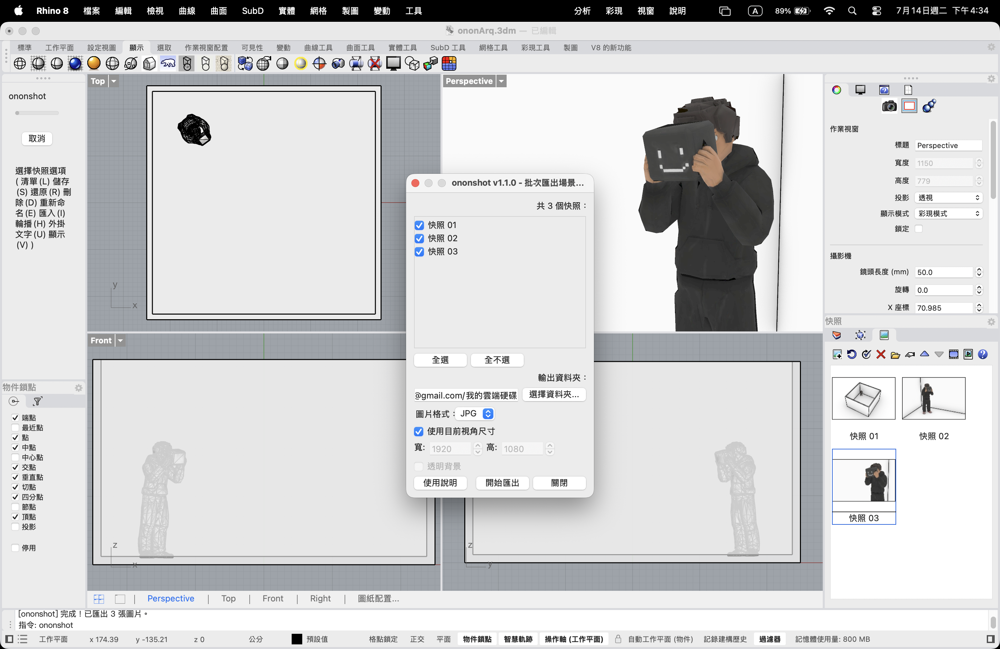

# ononshot

## 中文

Rhino 8 外掛：批次把檔案裡的 Snapshots（快照，Panels > Snapshots 面板）逐一還原，並把目前作用中的視角擷取成圖片。

### 使用方式

1. 先用 Rhino 的 Snapshots 面板（Panels > Snapshots）建立好要輸出的快照。
2. 執行指令 `ononshot`。
3. 在跳出的視窗中勾選要匯出的快照、選擇輸出資料夾（會記住上次路徑）、圖片格式（PNG/JPG）、解析度（預設沿用目前視角尺寸）與是否透明背景（僅 PNG）。
4. 按「開始匯出」。視窗會先關閉，接著 Rhino 指令列會依序印出進度，外掛依序還原每個快照並擷取目前作用中的視角另存成同名圖片。

視窗右下角的「使用說明」按鈕也有同一份操作步驟。

### 安裝

到 [Releases](https://github.com/ZionW/ononshot/releases) 下載 `.yak`，用 Rhino 的 `_PackageManager` 安裝，或直接把 `.yak`／`.rhp` 拖進 Rhino 視窗。同一個 `.yak` 同時支援 Mac 與 Windows。

## English

A Rhino 8 plug-in that batch-restores every Snapshot in the current document (Panels > Snapshots) and captures the active viewport to an image for each one.

### Usage

1. Create the snapshots you want to export using Rhino's Snapshots panel (Panels > Snapshots) first.
2. Run the `ononshot` command.
3. In the dialog, check the snapshots to export, pick an output folder (remembered from last time), image format (PNG/JPG), resolution (defaults to the current viewport size), and optional transparent background (PNG only).
4. Click "開始匯出" (Start Export). The dialog closes first, then the Rhino command line prints progress as it restores each snapshot and saves the active view to a matching-name image file.

The "使用說明" (Usage) button in the dialog shows the same steps.

### Install

Download the `.yak` from [Releases](https://github.com/ZionW/ononshot/releases), install it via Rhino's `_PackageManager`, or drag the `.yak`/`.rhp` directly into a Rhino viewport. The same `.yak` works on both Mac and Windows.
